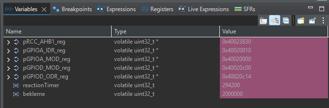

# Reaction Timer

A bare-metal reaction time game for the STM32F407G-DISC1 (STM32F4 Discovery) board, written directly at the register level — no HAL (Hardware Abstraction Layer), no CMSIS peripheral drivers, just direct memory-mapped register access.

## What it does

The board waits a random amount of time, then lights the onboard green LED (PD12). The player has to press the onboard user button (PA0) as fast as possible. The time between the LED turning on and the button press is measured with a busy-wait counter (`reactionTimer`). The cycle repeats indefinitely (`while(1)`), and the wait period for the next round is derived from the current round's reaction count, so it can't be memorized.

## Hardware

| Signal | Pin | Role |
|---|---|---|
| User button | PA0 | Input, pull-down (pressed = IDR bit reads 1) |
| Onboard LED | PD12 | Output, green LED |

Both PA0 and PD12 are onboard peripherals of the STM32F407G-DISC1 — no external wiring needed.

## Registers used

| Register | Address | Purpose |
|---|---|---|
| RCC_AHB1ENR (Reset and Clock Control, AHB1 Enable Register) | 0x40023830 | Enables clock for GPIOA (bit 0) and GPIOD (bit 3) |
| GPIOA_MODER (GPIOA Mode Register) | 0x40020000 | Sets PA0 to input mode |
| GPIOA_IDR (GPIOA Input Data Register) | 0x40020010 | Reads PA0 button state |
| GPIOD_MODER (GPIOD Mode Register) | 0x40020C00 | Sets PD12 to output mode |
| GPIOD_ODR (GPIOD Output Data Register) | 0x40020C14 | Drives PD12 LED high/low |

## How the timing logic works

Each round:

1. A wait period is calculated from the previous round's `reactionTimer`:
   `wait = 2,000,000 + (reactionTimer % 6,000,000)`
   This bounds the wait between 2,000,000 and 8,000,000 loop iterations, so it stays random but never degenerate (too short or absurdly long).
2. `reactionTimer` resets to 0.
3. A busy-wait loop burns through `wait` iterations (LED still off).
4. The LED turns on, and `reactionTimer` starts counting up in a busy-wait loop until the button is pressed.
5. The LED turns off, and the loop repeats.

On the very first round, `reactionTimer` is 0, so `wait` evaluates to a fixed 2,000,000 — a deterministic "seed" for the first round only. Every round after that is unpredictable, because it depends on how fast the player reacted.

## Known limitations

- `reactionTimer` is a raw loop-iteration count, not a real time unit (no millisecond value). Measuring actual elapsed time requires a hardware timer — this project doesn't have one yet.
- The wait range (2,000,000–8,000,000 iterations) was chosen as a reasonable guess relative to the loop's rough execution speed, not calibrated against real time.
- There's no on-device visual readout of the reaction result. The `reactionTimer` value is currently inspected through the debugger (Variables / Live Expressions view) after halting execution.

## Verified via debugger

The register pointer addresses and a sample `reactionTimer` value were confirmed against the source in STM32CubeIDE's Variables view:

## Possible next steps

- Add a `SysTick` (Cortex-M4 24-bit system timer) based measurement to convert `reactionTimer` into real time (ms).
- Add an on-device result readout (LED blink pattern or multi-LED level indicator).

---

## Türkçe Özet

STM32F407G-DISC1 kartı için, doğrudan register seviyesinde yazılmış bir tepki süresi ölçer. HAL (Hardware Abstraction Layer) veya CMSIS sürücüsü kullanılmıyor.

Kart rastgele bir süre bekliyor, sonra kart üstü yeşil LED'i (PD12) yakıyor. Oyuncu kart üstü butona (PA0) olabildiğince hızlı basmalı. LED yanmasıyla butona basılması arasındaki süre, busy-wait sayaç (`reactionTimer`) ile ölçülüyor.

Bir sonraki turun bekleme süresi, mevcut turun `reactionTimer` değerinden türetiliyor (`% 6.000.000` ile sınırlanıp `2.000.000` tabana ekleniyor) — böylece ezberlenemiyor. İlk tur `reactionTimer=0` olduğu için bekleme sabit 2.000.000'da başlıyor (deterministik "seed").

**Bilinen sınırlamalar:** `reactionTimer` gerçek zaman birimi değil, ham döngü sayısı — `SysTick` henüz eklenmedi. Bekleme aralığı deneysel kalibrasyon değil, mantıklı bir tahmin. Sonuç şu an sadece debugger üzerinden (Variables görünümü) izlenebiliyor, kart üstünde görsel bir gösterim yok.
